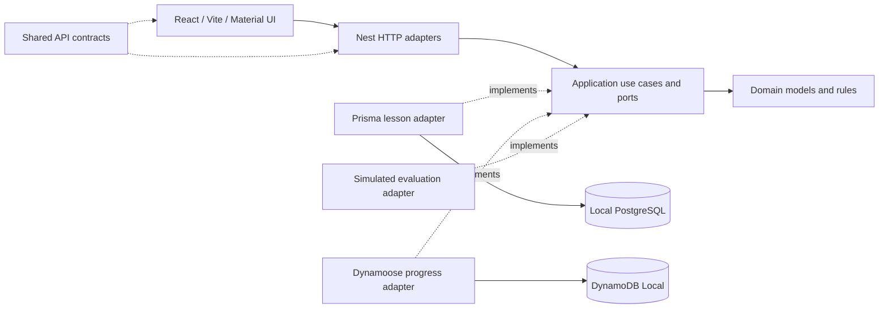

# Phonics foundation

**One word. Small sounds. A path toward reading.**


A phonics learning application for children learning to read and write in Brazilian Portuguese. The intended experience helps a learner explore how individual sounds combine into a complete word, at their own pace.

**Current delivery:** the local foundation and a technical demonstration are implemented. The complete learning activity, reference-audio playback, microphone recording and replay are planned. There is no writing exercise or claim of validated educational effectiveness in this version.

## The learning experience

Each activity focuses on one configurable word, such as **SAPO**. Its lesson defines an ordered progression:

1. Explore the individual letter sounds.
2. Combine the sounds into groups, such as **SA** and **PO**.
3. Practice the complete word, **SAPO**.

The planned single-page activity highlights the letters involved in each step. The learner listens to a reference recording, records an attempt, stops the recording, and replays the reference and their own attempt separately for self-comparison. They can listen and repeat before choosing to continue. A progress indicator shows their position in the lesson.

Each sound combination has its own reference recording. Learner recordings are intended to remain temporarily in browser memory, without being uploaded or stored in the databases.

## Product rules and data responsibilities

- A lesson contains its target word, language, ordered steps, highlighted letter positions, instructions and reference-audio locations.
- Lesson definitions and their ordered steps belong to PostgreSQL. The example SAPO lesson has four individual-sound steps, two combination steps and one full-word step.
- Anonymous session progress belongs to DynamoDB and references the lesson by its identifier. Progress is separate for each session and lesson.
- A saved completed-step count must be an integer between zero and the lesson's step count. Saving requires an existing lesson. The current demonstration allows resetting the count to zero.
- A new session has no saved progress. The browser retains an anonymous identifier so progress can be retrieved after a reload. This identifier is not an authenticated account.
- Evaluation currently returns deterministic, explicitly **simulated success**. It does not listen to recordings, assess pronunciation or prove that a child has mastered a sound. Progress in the demonstration is a technical storage check, not an educational assessment.
- Before changing an already-used lesson's step sequence, lesson versioning or progress migration must be defined so existing progress keeps its meaning.

## What works today

The responsive English/Portuguese preview retrieves the seeded SAPO lesson from the API, displays connection loading/success/error states, saves and reads anonymous progress, and shows the simulated evaluation label. Reference-audio locations are deliberately empty until real recordings are supplied.

The implementation includes browser-compatible shared contracts, a NestJS backend with framework-independent application logic, concrete Prisma and Dynamoose persistence adapters, repeatable migrations and initialization, local Docker services, automated tests and a GitHub Actions workflow.

Local verification passed: lint, formatting, type checks, production builds, 13 unit/UI/API-client tests, real database/API integration, and progress persistence after restarting the application and both databases. Desktop/mobile rendering and language switching were checked in the browser. See the [verification report](docs/verification.md) for exact evidence and limitations.

## Technology and architecture

| Area      | Implemented stack                                                  | Responsibility                                             |
| --------- | ------------------------------------------------------------------ | ---------------------------------------------------------- |
| Frontend  | React 19, Vite 8, TypeScript 5.9                                   | Browser application and shared API contracts               |
| Interface | Material UI 9, Emotion, i18next/react-i18next                      | Responsive styling and English/Portuguese resources        |
| Backend   | Node.js 24, NestJS 11, Express, Zod                                | HTTP transport, validation and application composition     |
| Lessons   | PostgreSQL 17, Prisma 7 and its pg adapter                         | Relational lesson definitions and ordered steps            |
| Progress  | DynamoDB Local 3.3, Dynamoose 4                                    | Anonymous progress by session and lesson                   |
| Workspace | pnpm 10.34.5, Turborepo 2                                          | Dependency management and ordered package tasks            |
| Quality   | ESLint, Prettier, Vitest, Testing Library, jsdom, Node test runner | Static checks, UI/unit tests and real database integration |
| Delivery  | Docker Compose and GitHub Actions                                  | Implemented local stack and automated CI workflow          |



The composition root connects ports to adapters explicitly. Domain and application code remain independent of NestJS, Prisma and Dynamoose. Database models and mapping stay inside persistence adapters; the shared package contains browser-compatible DTOs only.

```text
apps/frontend       Browser preview and UI tests
apps/backend        Domain, use cases, adapters, migrations and API tests
packages/shared     API contracts
docs                Setup contract, development guide and verification
```

## Run locally

Prerequisites: Node.js 24, Docker Desktop with Linux containers and Compose v2, the standard `tar` command, and available ports 3000, 4000, 5433 and 8000. pnpm is pinned; the command below uses the exact version. From the repository root:

```powershell
npx --yes pnpm@10.34.5 stack:up
```

This builds the applications, starts PostgreSQL and DynamoDB Local, applies migrations, seeds SAPO and initializes progress storage.

- Application: [http://localhost:3000](http://localhost:3000)
- API readiness: [http://localhost:4000/ready](http://localhost:4000/ready)

Stop the stack while retaining local data:

```powershell
docker compose down
```

For host development with hot reload, environment configuration, API contracts, tests, migrations, reset commands and adapter boundaries, see the [local development guide](docs/local-development.md).

After installing dependencies and configuring the local environment as described in that guide, the main commands are:

| Command                               | Purpose                                       |
| ------------------------------------- | --------------------------------------------- |
| `pnpm dev`                            | Run frontend and backend with file watching   |
| `pnpm db:migrate`                     | Apply relational migrations                   |
| `pnpm db:seed` / `pnpm db:init`       | Seed SAPO / initialize the progress table     |
| `pnpm lint` / `pnpm typecheck`        | Check source quality and types                |
| `pnpm test` / `pnpm test:integration` | Run unit/UI tests / real database integration |
| `pnpm build`                          | Build all workspace packages                  |

Only public API configuration reaches the browser. Actual `.env` files are ignored; examples and the dependency lockfile are committed.

## Next delivery stages

Implement the guided learning interaction, supply reference recordings, and add microphone permission handling, recording and replay with browser-memory cleanup. Any future pronunciation analysis must use a real evaluation adapter and results that clearly distinguish actual analysis from simulation.

### Planned delivery and AWS deployment

| Component              | Current status                      | Planned destination                                     |
| ---------------------- | ----------------------------------- | ------------------------------------------------------- |
| Frontend hosting       | Local Vite / Docker Nginx           | Amazon S3 and CloudFront                                |
| Backend hosting        | Local NestJS / Docker               | API Gateway and AWS Lambda; runtime adaptation required |
| Lesson persistence     | Local PostgreSQL through Prisma     | Aurora PostgreSQL-Compatible                            |
| Session progress       | DynamoDB Local through Dynamoose    | Amazon DynamoDB                                         |
| Continuous integration | GitHub Actions workflow implemented | Keep automated quality checks                           |

These are deployment plans, not provisioned services. AWS implementation remains outside this delivery. GitHub Actions is the chosen CI tool. Before deployment, validate cost feasibility within the **BRL 50 total budget**, configure production access controls, secrets, network/TLS, migrations and backups. No cloud infrastructure has been provisioned by this setup.

The [approved setup prompt](docs/setup-prompt.txt) is preserved exactly, including its original line endings.
